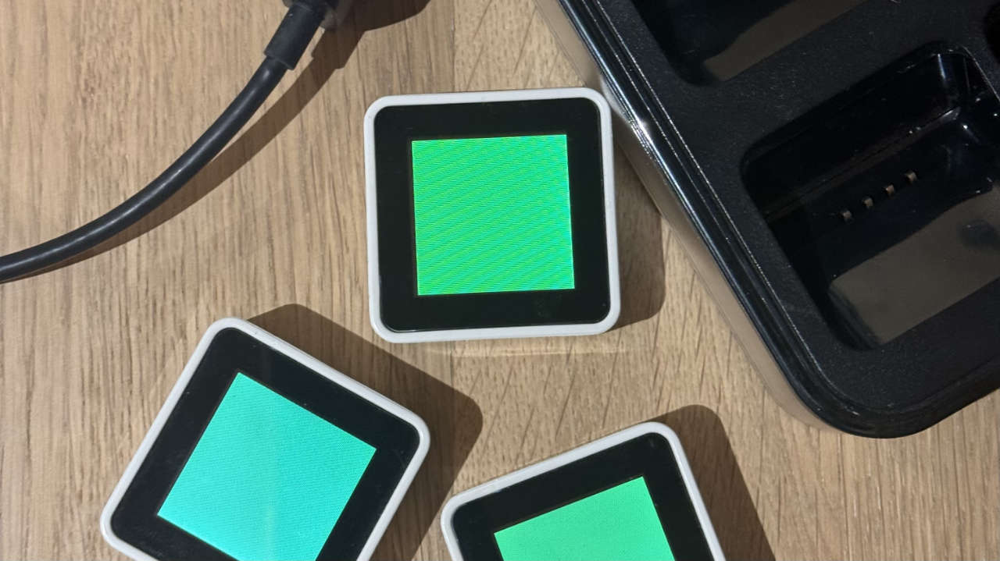

# Sifteo V1 Cubes - Open Source Host Software

Open-source host software for [Sifteo V1 Cubes](https://en.wikipedia.org/wiki/Sifteo_cubes) on modern macOS (Apple Silicon).


*Re-implemented version of the Sifteo Sync app*

Replaces the original 32-bit Intel SiftRunner application that no longer runs on current macOS versions. Communicates directly with the Sifteo USB dongle via `pyusb`/`libusb`, driving the cubes' 128x128 LCD displays, reading accelerometer tilt, button presses, shake gestures, and neighbor detection - all from Python.


*Photo of the original Sifteo Cubes, generation 1, controlled through a USB-connected dongle*

## Quick Start (GUI)

The graphical Cube Manager lets you connect to the dongle, browse all 23 bundled legacy games, install `.siftapp` bundles onto cubes, and tune upload settings -- all from a single window.

```bash
# Install with GUI support
pip install -e '.[gui]'

# Launch the Cube Manager
sudo python3 -m sifteo gui
```

The GUI auto-detects the dongle, discovers cubes, and offers a one-click "Relaunch as root" button if you forget `sudo`. Upload speed can be adjusted live from the settings panel.

## Quick Start (Command Line)

```bash
# Install dependencies
pip install pyusb hidapi

# Or install as a package
pip install -e .

# Detect dongle (no root needed)
python3 -m sifteo detect

# Run the color demo (requires root for USB access)
sudo python3 -m sifteo demo

# Install a legacy .siftapp bundle onto connected cube(s)
sudo python3 -m sifteo install-siftapp sifteo-gen1-redux/payload/Siftapps/siftsays.siftapp

# Optional: force bundle extraction mode (decrypt + unzip + .sftbndl parsing)
sudo python3 -m sifteo install-siftapp path/to/app.siftapp --install-mode bundle

# Optional fallback/compat mode: upload opaque container bytes directly
sudo python3 -m sifteo install-siftapp path/to/app.siftapp --install-mode opaque

# Optional: use header-derived app IDs (legacy-style). Default uses
# crc32(filename) to avoid ID collisions between archived bundles.
sudo python3 -m sifteo install-siftapp path/to/app.siftapp --prefer-header-app-id

# Optional (opaque mode only): payload extraction and CRC compatibility toggles
sudo python3 -m sifteo install-siftapp path/to/app.siftapp --install-mode opaque --payload-shape auto --payload-crc auto

# Or use the helper by short app name + cube target
# ("all" => all detected cubes)
./examples/install_app.py siftsays 0

# Verify transport using known legacy .siftimg fixtures (cube-side CRC checks)
SIFTEO_WRITE_MIN_GAP=0.001 SIFTEO_WRITE_MAX_RETRIES=5 \
PYTHONPATH=src sudo /opt/homebrew/bin/python3.9 \
examples/verify_fixture_upload.py --cube-id 0 --quick --delete-first

# Optional stronger transport proof: CRC + download byte-for-byte roundtrip
PYTHONPATH=src sudo /opt/homebrew/bin/python3.9 \
examples/verify_fixture_upload.py --cube-id 0 --quick --roundtrip

# Inspect .siftapp container structure for reverse engineering
python3 examples/analyze_siftapp.py --scan-crypto

# Run the interactive probe tool
sudo python3 probe_dongle.py

# Run the Hello World example
sudo python3 examples/hello_world.py
```

Root access is required on macOS because the kernel HID driver must be detached to get raw USB interrupt transfer access to the dongle. (IOHIDManager's `IOHIDDeviceSetReport` does not work for this device's interrupt OUT endpoint.)

`.siftapp` support now defaults to legacy bundle installation: decrypt the container, open the embedded ZIP, parse `.sftbndl` image bundles, and upload extracted assets to cube flash. `auto` mode falls back to opaque container upload only when bundle extraction is not possible. Running legacy .NET game logic is still outside the Python runtime.
Opaque compatibility tuning remains available via `--install-mode opaque` with `--payload-crc` and `--payload-shape`.

### Upload Speed Tuning

Asset upload throughput is mostly limited by the USB inter-packet gap (`WRITE_MIN_GAP`).
Default is conservative (`0.025s`) for stability.
Uploads now use per-packet dongle ACKs (matching legacy SiftRunner behavior)
to avoid packet drops that can cause flash misalignment failures.

To speed up uploads, lower the gap via environment variable or via the GUI settings panel:

```bash
# ~5x faster than default on many setups; raise again if unstable
sudo SIFTEO_WRITE_MIN_GAP=0.005 python3 -m sifteo install-siftapp path/to/app.siftapp --cube-id 0

# Works with helper script too
SIFTEO_WRITE_MIN_GAP=0.005 ./examples/install_app.py siftsays 0
```

Optional retry tuning:

```bash
SIFTEO_WRITE_MAX_RETRIES=5
SIFTEO_WRITE_ACK_TIMEOUT=5.0
```

## Writing Games

Subclass `BaseApp` and override event handlers:

```python
from sifteo import BaseApp, Cube

class MyGame(BaseApp):
    def setup(self):
        for cube in self.cubes:
            cube.fill(0, 0, 255)  # Blue

    def on_button(self, cube, pressed):
        if pressed:
            cube.fill(255, 0, 0)  # Red

    def on_tilt(self, cube, x, y, z):
        pass  # x,y: 0=tilt, 1=level, 2=tilt

    def on_shake(self, cube):
        cube.fill(0, 255, 0)  # Green

    def on_neighbor_add(self, cube, side, neighbor, neighbor_side):
        # Two cubes were placed next to each other
        neighbor.fill(255, 255, 0)

if __name__ == "__main__":
    MyGame().run()
```

See [examples/hello_world.py](examples/hello_world.py) for a complete example with color cycling, tilt control, shake randomization, and neighbor synchronization.

## Event support

`sudo python3 -m sifteo demo` will detect events and recognize context of the cubes.

```bash
  ShakeEvent(cube=2)
  TiltEvent(cube=2, x=0, y=0, z=1)
  ShakeEvent(cube=2)
  TiltEvent(cube=2, x=1, y=0, z=1)
  TiltEvent(cube=2, x=1, y=0, z=2)
  NeighborEvent(cube=3, side=1, neighbor=2)
  NeighborEvent(cube=3, side=1, removed)
  TiltEvent(cube=1, x=2, y=0, z=0)
```

## Architecture

```
Your Python Game (BaseApp subclass)
  |  Python API (fill, draw_rect, on_tilt, on_button, ...)
  v
SifteoRunner (event loop, cube lifecycle, neighbor sync)
  |  Protocol messages (33-byte USB HID packets)
  v
SifteoDongle (pyusb/libusb, background RX thread, dual queues)
  |  USB Interrupt Transfers (EP 0x81 IN, EP 0x01 OUT)
  v
Sifteo USB Dongle (nRF24LU1+ @ VID:0x22FA PID:0x0101)
  |  2.4 GHz nRF24L01+ Enhanced ShockBurst
  v
Sifteo V1 Cubes (STM32 ARM Cortex-M3 + 128x128 LCD + accelerometer)
```

## How the Controller Was Built

The original SiftRunner was a 32-bit Intel macOS application built with C++, Qt, PythonQt, and Mono. It bundled encrypted Python source files (`.epy`) that implemented the actual USB protocol and cube management logic, plus a .NET runtime for loading game DLLs via JSON-RPC over TCP.

None of this runs on modern macOS: the binary is 32-bit Intel (dropped in Catalina), the embedded Python is 2.x, and the native USB libraries target i386/x86_64/ppc.

The approach to recreate a working controller was:

1. **Decrypt the original Python sources.** The `.epy` files inside SiftRunner.app were AES-128-CFB encrypted. The key and IV were extracted from the SiftRunner binary. Once decrypted, the full protocol implementation was readable: `dongle.py`, `dongle_helper.py`, `graphics_helper.py`, `asset_helper.py`, `message.py`, `opcodes.py`, and the complete game API (`siftable.py`, `sift_set.py`, `neighbors.py`, `base_app.py`).

2. **Decompile the .NET game SDK.** The `Sifteo.dll` game API was decompiled to C#, revealing the JSON-RPC interface between games and SiftRunner and the complete public API (`Cube.cs`, `BaseApp.cs`, `Sound.cs`, etc.). This confirmed the protocol semantics found in the Python sources.

3. **Build a USB probe tool.** With the protocol understood, `probe_dongle.py` was written as a standalone script using `pyusb` for raw USB interrupt transfers. This bypasses the macOS HID driver (which doesn't support the dongle's interrupt OUT endpoint correctly). The probe tool verified each protocol operation: dongle version query, cube discovery, whitelist management, tilt/button/shake/neighbor events, graphics fill/rect/draw commands, and RF spectrum scanning.

4. **Create a clean Python library.** The verified protocol was reimplemented as a proper Python package (`src/sifteo/`) with separated concerns: `protocol.py` (opcodes, message format, command builders), `dongle.py` (USB layer, background RX thread, dual response/event queues), `cube.py` (per-cube state, event parsing, display API), `runner.py` (event loop, cube lifecycle, neighbor synchronization), and `app.py` (developer-facing `BaseApp` with simple event handlers).

5. **Document the protocol.** All findings were compiled into [PROTOCOL.md](PROTOCOL.md): complete opcode tables, packet formats, the `.epy` encryption scheme, color format (RGB332), asset upload protocol, and hardware specifications.

## Project Structure

```
src/sifteo/          Modern Python library
  __main__.py        CLI entry point (detect / gui / run / demo / install-siftapp)
  app.py             BaseApp - subclass this for games
  runner.py          Event loop, cube lifecycle, neighbor sync
  dongle.py          USB dongle communication (pyusb, backend abstraction)
  protocol.py        Opcodes, message format, command builders
  cube.py            Per-cube state, events, display API
  detect.py          Dongle detection and diagnostics
  gui/               Graphical Cube Manager (pywebview)
    app.py           Window setup and lifecycle
    bridge.py        Python<->JS bridge (dongle, install, settings)
    catalog.py       Game metadata for 23 bundled .siftapp titles
    web/             HTML/CSS/JS frontend

probe_dongle.py      Interactive protocol probe & test tool
examples/            Example games
decrypted_py/        Original decrypted Sifteo Python sources
decompiled/          Decompiled .NET game SDK (C#)
PROTOCOL.md          Complete protocol documentation
```

## Requirements

- macOS (tested on Apple Silicon, should work on Intel too)
- Python 3.9+
- `libusb` (install via `brew install libusb`)
- `pyusb` >= 1.2
- `pywebview` >= 5.0 (optional, for the GUI -- install with `pip install -e '.[gui]'`)
- A Sifteo V1 USB dongle and one or more V1 cubes

## Acknowledgments

This project would not have been possible without the work of several people and projects:

- **[Sifteo Inc.](https://en.wikipedia.org/wiki/Sifteo_cubes)** - Jeevan Kalanithi, David Merrill, and the entire Sifteo team for creating such an incredible and unique hardware platform.

- **[@dannyow](https://github.com/dannyow)** - For [sifteo-gen1-redux](https://github.com/dannyow/sifteo-gen1-redux), the community effort to preserve and rebuild the Sifteo V1 ecosystem. The packaged SiftRunner installer and collected game apps were the starting point for this project.

- **Dr. Mike Reddy**  - For his blog post [Sifteo: Resurrecting a Legend](http://doctormikereddy.com/sifteo-resurrecting-a-legend/), which documented the effort to locate original Sifteo apps and binaries, and for his extensive work preserving Sifteo's history.

- **[pyusb](https://github.com/pyusb/pyusb)** contributors - For the Python USB library that made direct dongle communication on modern macOS possible without writing a kernel extension.

- **[libusb](https://libusb.info/)** contributors - For the cross-platform USB access library underlying pyusb.

## License

MIT
